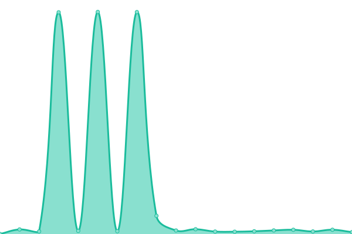

# [📈 Live Status](https://up.ferdi.js.cool): <!--live status--> **🟩 All systems operational**

This repository contains the open-source uptime monitor and status page for [uptime666](https://up.ferdi.js.cool), powered by [Upptime](https://github.com/upptime/upptime).

With [Upptime](https://upptime.js.org), you can get your own unlimited and free uptime monitor and status page, powered entirely by a GitHub repository. We use [Issues](https://github.com/uptime666/upptime/issues) as incident reports, [Actions](https://github.com/uptime666/upptime/actions) as uptime monitors, and [Pages](https://up.ferdi.js.cool) for the status page.

<!--start: status pages-->
<!-- This summary is generated by Upptime (https://github.com/upptime/upptime) -->
<!-- Do not edit this manually, your changes will be overwritten -->
<!-- prettier-ignore -->
| URL | Status | History | Response Time | Uptime |
| --- | ------ | ------- | ------------- | ------ |
|  [Okteto Movies](https://movies-linuxrun1.cloud.okteto.net/) | 🟩 Up | [okteto-movies.yml](https://github.com/uptime666/upptime/commits/HEAD/history/okteto-movies.yml) | 

 220ms
     
 | 

<a href="https://up.ferdi.js.cool/history/okteto-movies">98.25%</a>
    

|  [My Linux SSH](https://mylnx-mylnx-linuxrun1.cloud.okteto.net/) | 🟩 Up | [my-linux-ssh.yml](https://github.com/uptime666/upptime/commits/HEAD/history/my-linux-ssh.yml) | 

 5206ms
     
 | 

<a href="https://up.ferdi.js.cool/history/my-linux-ssh">99.12%</a>
    

<!--end: status pages-->

[**Visit our status website →**](https://up.ferdi.js.cool)

## 📄 License

- Powered by: [Upptime](https://github.com/upptime/upptime)
- Code: [MIT](./LICENSE) © [uptime666](https://up.ferdi.js.cool)
- Data in the `./history` directory: [Open Database License](https://opendatacommons.org/licenses/odbl/1-0/)
